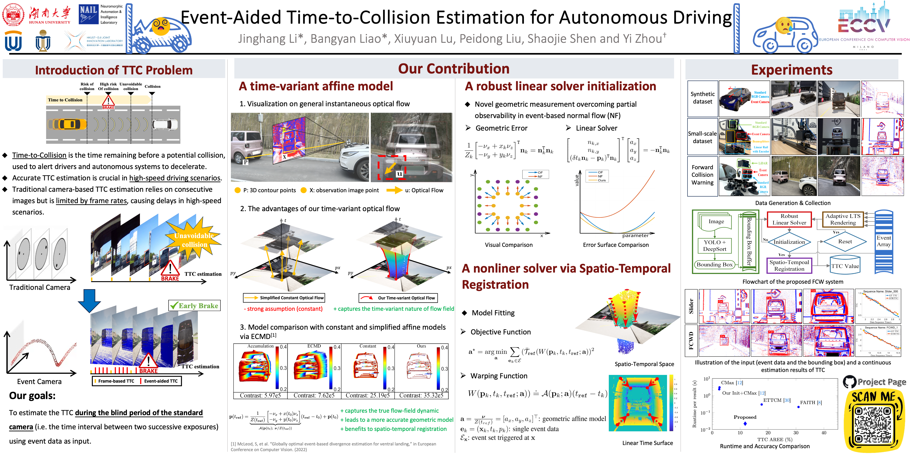

# Event-Aided Time-to-Collision Estimation for Autonomous Driving (ECCV2024)

Welcome to the official repository of **Event-Aided Time-to-Collision Estimation for Autonomous Driving**, an open-source project presented at ECCV 2024. This repository contains the implementation and relevant materials for our paper on time-to-collision estimation using event-based cameras. The **project page** is available [here](https://nail-hnu.github.io/EventAidedTTC/).

## Overview


This project focuses on leveraging neuromorphic event-based cameras for accurate **Time-to-Collision (TTC)** estimation, especially in high-speed dynamic scenarios. Event cameras offer several advantages over traditional frame-based cameras, such as low latency, high temporal resolution, and efficient handling of high-contrast environments, making them ideal for collision prediction tasks.


## Installation

Please follow the steps below to set up the project:

### Prerequisites
- Windows 10/11 + MATLAB R2022a

### Setup
1. Clone the repository:
   ```sh
   git clone https://github.com/NAIL-HNU/event_aided_ttc.git
   ```

2. Download the dataset:
   - The dataset can be downloaded from [this link](https://pan.baidu.com/s/1NrXNPmbuax-9ypreRICgvg?pwd=v3wf).
   - Place the downloaded dataset `FCWD` in the `Datasets` directory as follows:
     ```
     strttc_matlab_ws
     ├── Datasets
     │   └── FCWD
     └── matlab_code
         ├── main
         │   ├── function
         │   │   └── calculateSTRTTC.m
         │   └── main_FCWD.m
         └── utils
             ├── Find_nearest_index.m
             ├── GetValidPointonNLTS.m
             ├── ......
             └── strttc_optimize.m
     ```

## Usage

### MATLAB Code Instructions

Before running the MATLAB code, please modify the following paths in `main_FCWD.m`:
- `root_path = "C:\Users\lijin\Downloads\test\strttc_matlab_ws\";`
- `datasetRootDir = 'C:\Users\lijin\Downloads\test\strttc_matlab_ws\Datasets\FCWD\20240302';`

Once the paths are set, you can run the code by executing `main_FCWD.m`.


## Project Page
For more detailed information, examples, and visual results, please visit our [project page](https://nail-hnu.github.io/EventAidedTTC/).


## Results
Our method achieves state-of-the-art performance in several TTC estimation benchmarks. Detailed quantitative and qualitative results can be found on the [project page](https://nail-hnu.github.io/EventAidedTTC/).

## Video Demonstration
Check out our video demonstration on YouTube:

[](https://www.youtube.com/watch?v=aXBN--UHCSg)

## Citation
If you find this work useful in your research, please consider citing:

```bibtex
@misc{li2024eventaidedtimetocollisionestimationautonomous,
    title         = {Event-Aided Time-to-Collision Estimation for Autonomous Driving},
    author        = {Jinghang Li and Bangyan Liao and Xiuyuan LU and Peidong Liu and Shaojie Shen and Yi Zhou},
    year          = 2024,
    eprint        = {2407.07324},
    archiveprefix = {arXiv},
    primaryclass  = {cs.CV}
}
```

## License
This project is licensed under the MIT License. See the `LICENSE` file for details.

## Acknowledgments
We thank Javier Hidalgo-Carrió and Davide Scaramuzza for releasing the design of the Beamsplitter in [Event-aided Direct Sparse Odometry (EDS)](https://github.com/uzh-rpg/slam-orogen-eds), based on which we build our FCW system. We also thank Dr. Yi Yu for proof reading. This work was supported by the National Key Research and Development Project of China under Grant 2023YFB4706600.


## Contact
For any questions or inquiries, please contact us at:
- **JinghangLi**: jhanglee@hnu.edu.cn

Or open an issue in this repository.